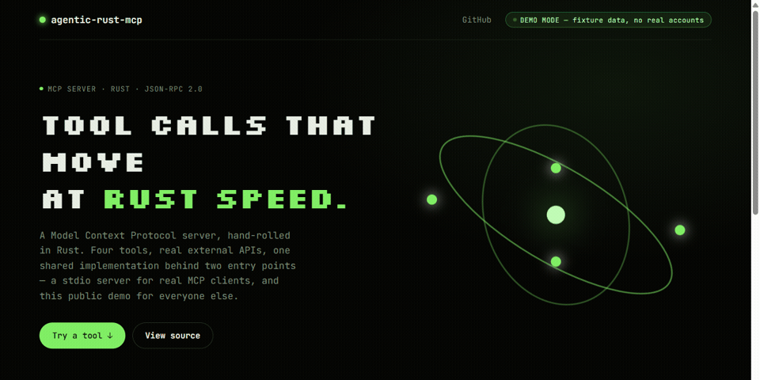

<p align="center">
  
</p>

<p align="center">
  <a href="https://agentic-rust-mcp-demo.onrender.com"><strong>▶ Live Demo</strong></a> — click any tool button, no signup, no real accounts touched
</p>

An MCP (Model Context Protocol) server written in Rust, hand-rolled over JSON-RPC 2.0/stdio. It exposes 4 tools that call real external APIs (Render, Vercel, Buffer, Firestore, Gmail), plus the public HTTP demo above so anyone can try it from a browser without running an MCP client.

## Tools

| Tool | What it does |
|------|--------------|
| `agency_pulse` | Polls Render + Vercel and returns a rolled-up deployment status |
| `content_check` | Polls Buffer for scheduled posts across social profiles |
| `data_vault` | Queries a Firestore `leads` collection |
| `send_gmail` | Sends an email via Gmail SMTP (`to`, `subject`, `body`) |

Each tool degrades gracefully when its API key isn't configured — it reports an empty/`configuration_error` state instead of crashing.

## Two entry points, one shared implementation

- **`src/main.rs`** — the MCP server. JSON-RPC 2.0 over stdin/stdout, for real MCP clients (Claude Desktop/Code) with real credentials in `.env`.
- **`src/bin/web_server.rs`** — the public web demo. An Axum HTTP server exposing the same 4 tools as `POST /api/*`, plus a static page at `/`. **Refuses to start unless `DEMO_MODE=true`** — this binary has no auth, so it must never be able to reach real accounts.

Both call the same tool implementations in `src/tools.rs` — nothing is duplicated between them.

## Demo Mode

Set `DEMO_MODE=true` and every tool returns realistic fixture data instead of calling a real account. `send_gmail` in demo mode simulates a send and never actually delivers mail. This is what the public deployment runs — no real credentials are set on that Render service at all.

## Quick Start

```bash
# Build both binaries
cargo build --release

# Run the stdio MCP server (for a real MCP client, with real .env credentials)
cp .env.example .env   # fill in whichever keys you have
./target/release/agentic-rust-mcp

# Run the web demo locally
DEMO_MODE=true PORT=8080 ./target/release/web_server
```

## MCP Protocol Usage

```json
{"jsonrpc": "2.0", "id": 1, "method": "initialize", "params": {}}
{"jsonrpc": "2.0", "id": 2, "method": "tools/list", "params": {}}
{"jsonrpc": "2.0", "id": 3, "method": "tools/call", "params": {"name": "agency_pulse", "arguments": {}}}
{"jsonrpc": "2.0", "id": 4, "method": "tools/call", "params": {"name": "send_gmail", "arguments": {"to": "x@example.com", "subject": "hi", "body": "hello"}}}
```

## Security

- Credentials load from `.env` (gitignored) via `dotenv` — nothing hardcoded.
- The public web demo can never reach real accounts: it hard-exits at startup unless `DEMO_MODE=true`, and no real keys are ever set on that deployment.
- No authentication layer exists on the web demo's API routes — it's read-only fixture data by design, not a production API surface.

## Logging

Structured JSON logs via `tracing`:

```bash
RUST_LOG=info ./target/release/agentic-rust-mcp
RUST_LOG=debug ./target/release/agentic-rust-mcp
```

## Architecture

```
   MCP client (stdio)         Browser (public demo)
          │                            │
          ▼                            ▼
   src/main.rs                 src/bin/web_server.rs
   (JSON-RPC 2.0)               (Axum, DEMO_MODE-gated)
          │                            │
          └──────────────┬─────────────┘
                          ▼
                    src/tools.rs
        (agency_pulse, content_check,
          data_vault, send_gmail)
                          │
        ┌────────┬────────┬────────┬────────┐
        ▼        ▼        ▼        ▼        ▼
    Render    Vercel    Buffer  Firestore  Gmail
```

## Tech Stack

| Layer | Technology |
|-------|-----------|
| Runtime | tokio (async/await) |
| Web server | axum |
| Serialization | serde / serde_json |
| HTTP client | reqwest |
| Logging | tracing + tracing-subscriber |
| Config | dotenv |
| Email | lettre |
| Timestamps | chrono |
| Testing | built-in `cargo test` |

## License

MIT

## Author

Chris Brown
[Albatross AI](https://albatrossai.online)
[Portfolio](https://chrisbrown-dev.vercel.app)
